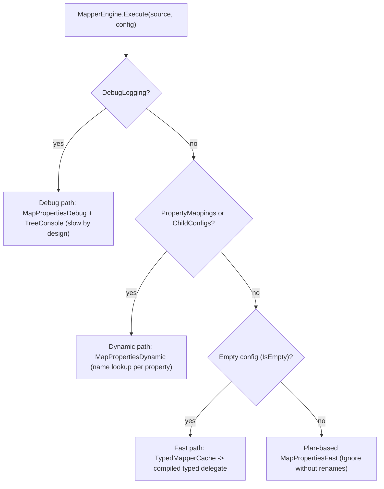

# AGENTS.md

Guidance for AI coding agents working in this repository.

## What this repository is

**SimpleMapper.Net** — a NuGet library for object-to-object mapping in .NET, an MIT-licensed alternative to AutoMapper. Convention-based mapping with compiled expression trees, a fluent builder for per-call overrides, and a single dependency (`Microsoft.Extensions.DependencyInjection.Abstractions`).

## Language conventions

- **Project language is English**: code, XML doc comments, exception messages, README and everything under `docs/`.
- `docs/pt-br/` holds Brazilian Portuguese translations; the English originals are canonical. When you change behavior or API, update the English docs **and** their pt-br mirrors.
- Internal planning artifacts under `specs/` are written in pt-BR and are git-ignored.
- No emojis in any artifact (code, docs, commits). Use `->` instead of arrow glyphs in strings and comments. Diagrams are Mermaid, never ASCII art.
- **Commit messages are in English**, following Conventional Commits (`feat:`, `fix:`, `refactor:`, `chore:`, `docs:`, `perf:`, `test:`), imperative mood, first line under ~72 chars with no trailing period. Never add AI credits, `Co-Authored-By` trailers or tool attributions.

## Structure and commands

| Path | Contents |
| --- | --- |
| `SimpleMapper.Net.slnx` | Solution (.NET 10 slnx format) |
| `src/SimpleMapper.Net/` | The library (PackageId `SimpleMapper.Net`, net10.0, MIT) |
| `tests/SimpleMapper.Net.Tests/` | xUnit; 51 tests; `InternalsVisibleTo` grants access to internal types |
| `benchmarks/SimpleMapper.Net.Benchmarks/` | BenchmarkDotNet vs AutoMapper 14.0.0 (last MIT version; benchmark-only dependency) |
| `docs/` | `architecture.md`, `benchmarks.md` (EN) + `pt-br/` translations |

```bash
dotnet build SimpleMapper.Net.slnx -c Release   # zero warnings is the bar
dotnet test SimpleMapper.Net.slnx               # full suite
dotnet test --filter "FullyQualifiedName~DeepPathTests"   # single class
dotnet pack src/SimpleMapper.Net/SimpleMapper.Net.csproj -c Release   # nupkg + snupkg
dotnet run -c Release --project benchmarks/SimpleMapper.Net.Benchmarks -- --list flat
docker compose -f docker-compose.benchmarks.yml up --build   # reproducible benchmarks (2 CPU/2GB)
# Docker VM with fewer resources: BENCH_CPUS=1 BENCH_MEM=2g docker compose ... up
```

## Architecture

Full internals documentation: `docs/architecture.md` — read it before touching the engine. Summary: `MapperEngine.Execute` selects one of three execution paths:



- **Three cache layers** via `ConcurrentDictionary.GetOrAdd` (lazy, lock-free reads): `GettersCache`/`SettersCache` (per-property delegates — Dynamic/Debug paths), `PlanCache` (pre-classified `TypePlan`/`PropertyPlan`), `TypedMapperCache` (`CompiledPair` — fast path).
- **Deep navigation**: `MapperBuilder` converts lambdas with `Each()` into a `MappingConfig.ChildConfigs` tree via `PathExtractor` (marker `"*"`); `Each()` never runs at runtime (it throws).
- **Polymorphism (WIP)**: `RegisterSubtype`/`MapSubtype` are under `[Experimental("SMEXP001")]`; discriminators live in a global static registry with a short-circuit cache (`HasSubtypeRules`).

## Invariants and gotchas

- **The `useFast` check in `MapperEngine.Execute` (both overloads) is the heart of the performance design.** Every new `MappingConfig` capability must be reflected there — a non-empty config falling into the fast path is silently ignored; an empty config routed to the dynamic path regresses performance for everyone. Run the benchmarks after touching it.
- **Subtype rules must be registered before the first `MapTo`** of the affected types — `HasSubtypeRules` caches "no rules" on first mapping and later registrations may be ignored. The registry is global/static and leaks across tests.
- **`NullabilityInfoContext` is not thread-safe** — it stays a local variable in `BuildSetters`, never a static field.
- **Skip-if-null semantics**: a non-nullable target property with a null source value is skipped (keeps its default).
- **Recursion depth guard (CWE-674)**: nested mapping is bounded by `SimpleMapperOptions.MaxDepth` (default 100) via a `[ThreadStatic]` counter (`MapperEngine.EnterMapping`/`ExitMapping`, always in `try`/`finally`). A cyclic or too-deep graph throws the catchable `MappingDepthExceededException` instead of a StackOverflowException. Any new recursion carrier must be wrapped by the guard; covered by `RecursionGuardTests`.
- **Instantiation**: an accessible parameterless constructor (public or protected) is used when present; without one, `RuntimeHelpers.GetUninitializedObject` creates the instance **without running any constructor** (covered by `UninitializedFallbackTests`). There is no `AllowUninitialized()` — that no-op API was removed in v1.
- **`[Experimental]`**: consumers of the subtype APIs must suppress `SMEXP001` (tests and benchmarks already do via `NoWarn` in their csproj).
- **AutoMapper in the benchmark is pinned to 14.0.0** (last MIT version; advisory GHSA-rvv3-g6hj-g44x has no fix in the MIT line — `NoWarn NU1903` is justified in the csproj). Do not bump to 15+ (commercial license).
- **Zero warnings is a build requirement** — the library generates XML docs (`GenerateDocumentationFile`), so every new public member needs an XML doc comment.
- **Package metadata**: `RepositoryUrl`/`PackageProjectUrl` point to https://github.com/giacomeli/SimpleMapper.

## Known pending work

- Multi-target port to net8.0+ (`net8.0;net10.0`) planned after v1.
- Move the subtype registry from global static to instance/DI-scoped configuration (precondition for removing `[Experimental]`).

## Verification checklist

Before considering a change done:

1. `dotnet build SimpleMapper.Net.slnx -c Release` — no errors and **no warnings**.
2. `dotnet test SimpleMapper.Net.slnx -c Release` — suite green.
3. Touched the engine/fast path? Run the benchmarks and compare against `benchmarks/results/`.
4. Changed behavior or API? Update `README.md` + `docs/` **and** the mirrors in `docs/pt-br/`.
5. Never commit or push without an explicit request from the user.
