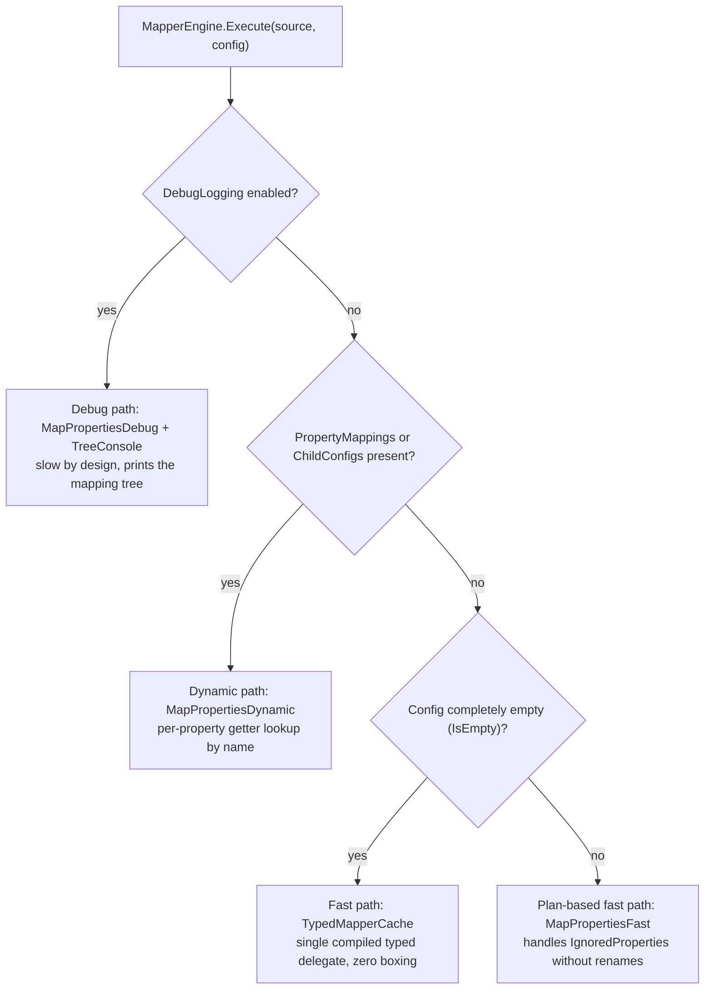
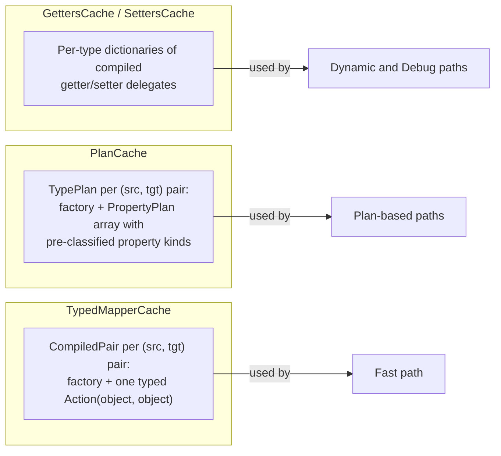
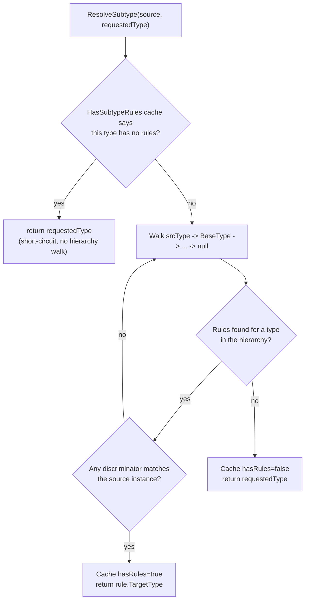
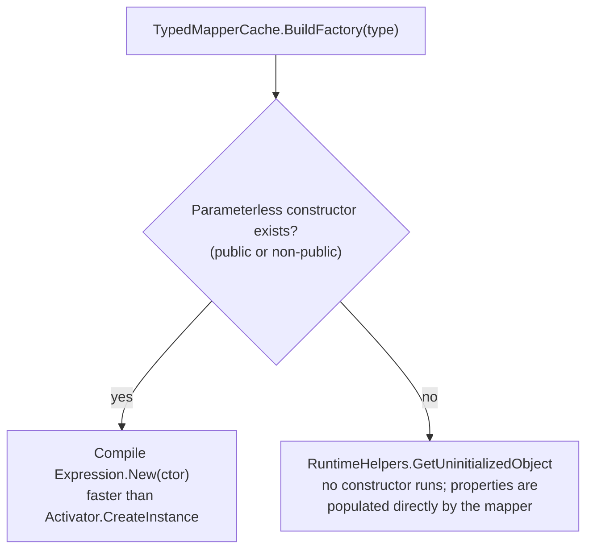

# Architecture: SimpleMapper.Net internals

This document explains how the engine works, why it is structured the way it is, and where the performance comes from. Read it before touching `MapperEngine`, `TypedPlanBuilder` or the caches.

## Execution paths

Every mapping enters through `MapperEngine.Execute`, which selects one of three execution paths based on the `MappingConfig` built by the fluent builder (or `MappingConfig.Default` for zero-config calls):



- **Fast path** (`TypedMapperCache` + `TypedPlanBuilder`) — used by ~99% of real calls. A single compiled `Action<object, object>` casts both objects once and assigns property by property with typed expressions. No boxing for value types, no dictionary lookups per property.
- **Dynamic path** (`MapPropertiesDynamic` + `PlanCache`) — used when the builder configured renames (`PropertyMappings`) or nested configs (`ChildConfigs`). Pays one hash lookup per property to resolve the source name.
- **Debug path** (`MapPropertiesDebug` + `TreeConsole`) — used when `WithDebugLogging()` was called. Walks the graph reflectively and prints every assignment, miss and skip as a console tree. Slow and allocation-heavy on purpose; diagnostic only.

### Why three paths instead of one

A unified path would pay hash lookups (`IgnoredProperties.Contains`, `PropertyMappings.TryGetValue`) and type classification checks per property, per call — measured at roughly +30 us on a ~60-property graph in earlier iterations. Splitting the paths means the zero-config majority pays none of that.

## The `useFast` check is the heart of the design

```csharp
var useFast = !cfg.DebugLogging && cfg.PropertyMappings.Count == 0
    && cfg.ChildConfigs.Count == 0;
```

Any new `MappingConfig` capability must be reflected here:

- If a non-empty config falls through to the fast path, its options are **silently ignored**.
- If an empty config is routed to the dynamic path, the fast-path performance regresses for everyone.

The benchmarks exist to catch regressions on this decision point.

## Cache layers

All caches are `ConcurrentDictionary` keyed by type (or type pair), populated lazily via `GetOrAdd` — first call compiles, subsequent calls are lock-free reads.



- **Layer 1 — `GettersCache` / `SettersCache`**: individual compiled delegates per property (`Func<object, object?>` / `Action<object, object?>`), plus `SkipIfNull` metadata derived from nullable reference type annotations. Feeds the dynamic and debug paths.
- **Layer 2 — `PlanCache`**: a `TypePlan` per `(source, target)` pair — an object factory plus a `PropertyPlan[]` where each property is pre-classified as `Simple`, `Dictionary`, `Collection` or `Complex`, with collection item types and list factories resolved at plan-build time instead of per call.
- **Layer 3 — `TypedMapperCache`**: a `CompiledPair` per `(source, target)` pair — the object factory plus one fully typed compiled mapper delegate produced by `TypedPlanBuilder`. This is the fast path.

## TypedPlanBuilder: the compiled mapper

`TypedPlanBuilder.Build(srcType, tgtType)` emits a single expression tree that, conceptually, compiles to:

```csharp
(object srcObj, object tgtObj) =>
{
    var src = (User)srcObj;         // typed cast, once
    var tgt = (UserDto)tgtObj;      // typed cast, once

    tgt.Id = src.Id;                // string: direct assignment
    tgt.Name = src.Name;            // string: direct assignment
    tgt.CreatedAt = src.CreatedAt;  // DateTime: direct, zero boxing

    if (src.Account != null)
        tgt.Account = (AccountDto)MapComplexObject(src.Account, typeof(AccountDto));

    if (src.Articles != null)
        tgt.Articles = (List<ArticleDto>)
            MapCollectionTyped<Article, ArticleDto>(src.Articles, false, false);
}
```

Nested complex objects and collection items route through `MapComplexObject` / `MapCollectionTyped`, which resolve the subtype, fetch (or build) the nested `CompiledPair` from `TypedMapperCache`, and recurse. Each nested type pair therefore gets its own compiled delegate.

Simple-type assignments handle three shapes at compile time: identical types (direct assignment), nullable/non-nullable variants of the same core type (`Expression.Convert`), and numeric coercion (`int -> long` etc.).

## Subtype resolution

`ResolveSubtype` implements polymorphic mapping (the WIP `MapSubtype`/`RegisterSubtype` feature):



The `HasSubtypeRules` cache is what makes the zero-subtype majority free — and it is also the reason rules **must be registered before the first mapping** of the affected types: once a type is cached as "no rules", later registrations may be ignored for it. This constraint is documented in the README and is one of the reasons the feature is marked experimental.

## Instance creation



The uninitialized fallback is what makes positional records and constructor-validated entities mappable with zero configuration. The trade-off — constructor invariants are bypassed — is documented in the README ("Null safety and instantiation") and covered by `UninitializedFallbackTests`.

## Recursion depth guard (CWE-674)

The engine recurses to map nested objects. A cyclic graph (bidirectional or ORM navigation references) or an extremely deep one would recurse until the thread's stack is exhausted, terminating the process with an uncatchable `StackOverflowException`.

To prevent this, every recursion carrier increments a `[ThreadStatic]` depth counter through `MapperEngine.EnterMapping()` / `ExitMapping()`, paired in a `try`/`finally` so the counter is restored on both return and throw. When depth would exceed `SimpleMapperOptions.MaxDepth` (default 100), a catchable `MappingDepthExceededException` is thrown instead.

The guard wraps all four recursion carriers — one per execution path plus the compiled path's nested-object helper:

| Carrier | Path |
| --- | --- |
| `TypedPlanBuilder.MapComplexObject` | Fast/compiled path (nested objects and collection items) |
| `MapperEngine.MapPropertiesFast` | Plan-based fast path (non-empty config) |
| `MapperEngine.MapPropertiesDynamic` | Dynamic path |
| `MapperEngine.MapPropertiesDebug` | Debug path |

The counter is thread-local, so concurrent mappings on different threads never interfere; because it is decremented in `finally`, a thread stays usable after catching the exception. Covered by `RecursionGuardTests`. This is the same weakness class as [CVE-2026-32933](https://github.com/advisories/ghsa-rvv3-g6hj-g44x) in AutoMapper.

## Technical notes

### Expression trees instead of raw reflection

`PropertyInfo.GetValue`/`SetValue` is roughly two orders of magnitude slower than direct access. Compiled expression trees produce delegates with hand-written-code performance; compilation cost is paid once per type (pair) and amortized across all subsequent calls.

Reference: [Expression Trees (C#)](https://learn.microsoft.com/en-us/dotnet/csharp/advanced-topics/expression-trees/)

### ConcurrentDictionary for thread-safe lazy caches

`GetOrAdd` with a factory delegate gives lock-free reads after first use and granular locking during population. Note that the factory may run more than once under a race; that is harmless here because compiled delegates are idempotent and the losing result is discarded.

Reference: [ConcurrentDictionary](https://learn.microsoft.com/en-us/dotnet/api/system.collections.concurrent.concurrentdictionary-2)

### NullabilityInfoContext must stay method-local

`NullabilityInfoContext` (used in `BuildSetters` to derive skip-if-null semantics) is **not thread-safe**. It is instantiated as a local variable so each thread building setters gets its own instance; the result is cached per type, so the cost is paid once.

Reference: [NullabilityInfoContext](https://learn.microsoft.com/en-us/dotnet/api/system.reflection.nullabilityinfocontext)

### Unbox-first value type assignment

Value-type setters compile to `val is T ? (T)val : (T)Convert.ChangeType(val, typeof(T))` — direct unboxing for the overwhelmingly common same-type case, with `Convert.ChangeType` reserved for numeric coercion (`int -> long`), avoiding its `IConvertible` lookup cost on the hot path.

### RuntimeHelpers.GetUninitializedObject over FormatterServices

`FormatterServices.GetUninitializedObject` is obsolete since .NET 7; `RuntimeHelpers.GetUninitializedObject` is the supported replacement.

Reference: [RuntimeHelpers.GetUninitializedObject](https://learn.microsoft.com/en-us/dotnet/api/system.runtime.compilerservices.runtimehelpers.getuninitializedobject)

## How to extend

### Adding a new builder option

1. Add the option to `MapperBuilder<TSource>` and thread it into `MappingConfig` via `BuildConfig`.
2. Decide which execution path honors it and, if it disqualifies the fast path, add it to the `useFast` check in **both** `Execute` overloads.
3. Add tests for the new option *and* a test proving zero-config mapping still takes the fast path.
4. Run the benchmark suite and compare against the previous results.

### Adding a new "simple" type

Types treated as scalars (copied by assignment, never recursed into) are listed in `MapperEngine.IsSimple`. Add the type there and cover it in `TypedMapperTests`.
