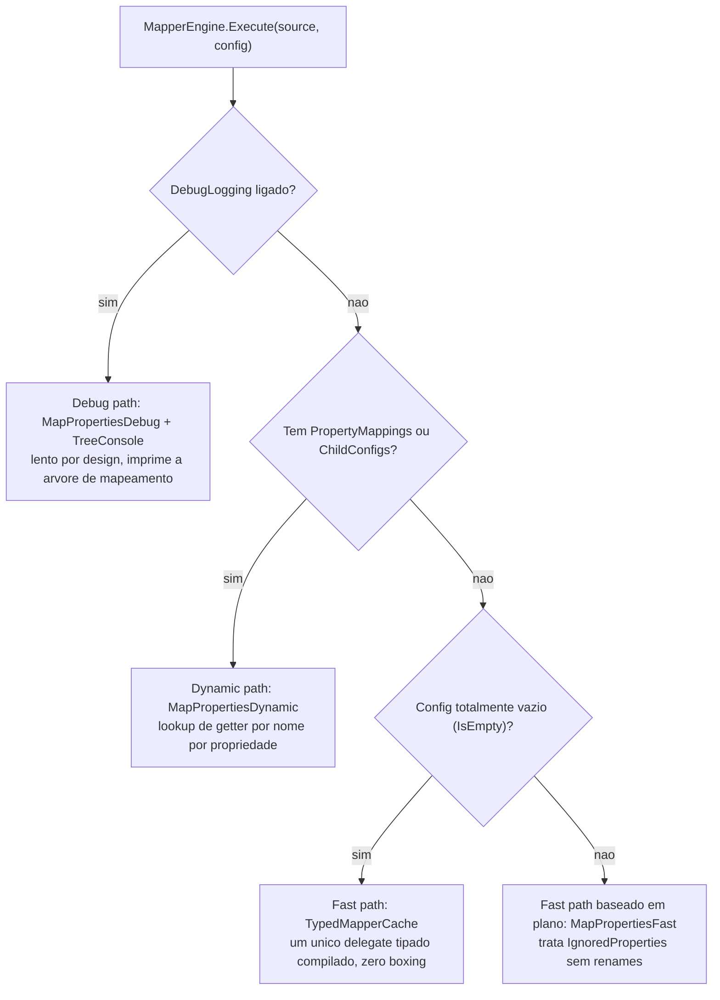
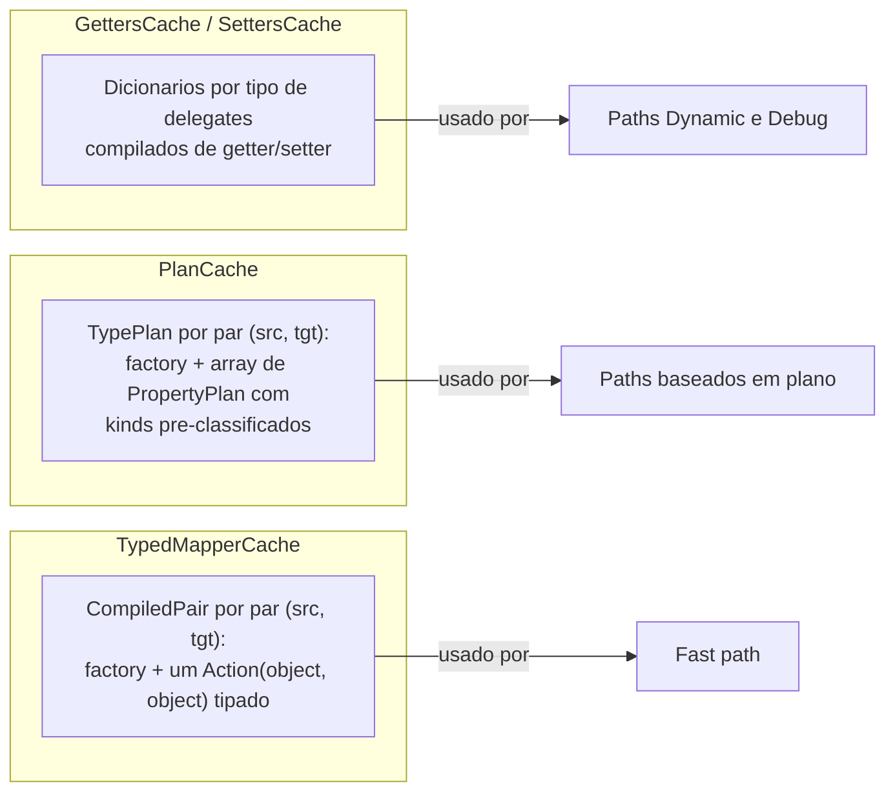
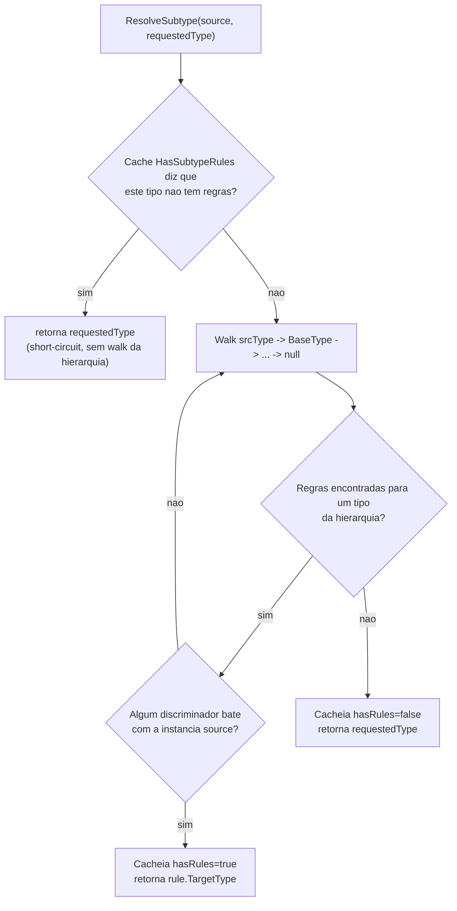
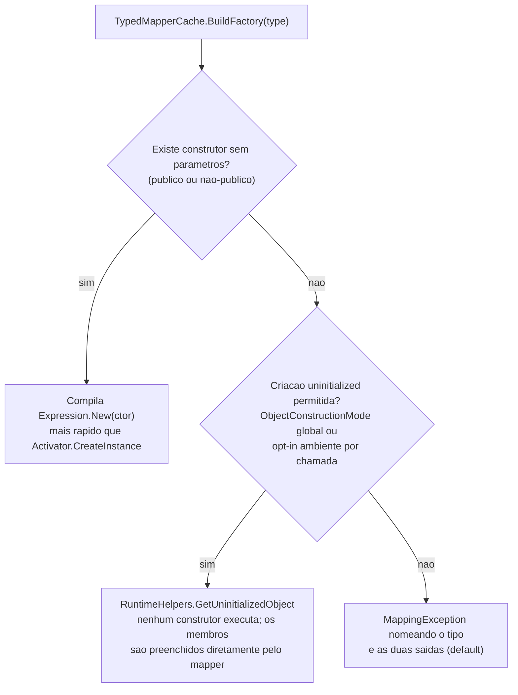

# Arquitetura: internals do SimpleMapper.Net

> Tradução em português brasileiro. O documento canônico é o [architecture.md](../architecture.md) em inglês.

Este documento explica como o engine funciona, por que está estruturado desse jeito e de onde vem a performance. Leia antes de mexer em `MapperEngine`, `TypedPlanBuilder` ou nos caches.

## Paths de execução

Todo mapeamento entra por `MapperEngine.Execute`, que seleciona um de três paths de execução com base no `MappingConfig` construído pelo builder fluente (ou `MappingConfig.Default` para chamadas de configuração zero):



- **Fast path** (`TypedMapperCache` + `TypedPlanBuilder`) — usado por ~99% das chamadas reais. Um único `Action<object, object>` compilado faz o cast dos dois objetos uma vez e atribui propriedade a propriedade com expressões tipadas. Sem boxing de value types, sem lookups de dicionário por propriedade.
- **Dynamic path** (`MapPropertiesDynamic` + `PlanCache`) — usado quando o builder configurou renames (`PropertyMappings`) ou configs aninhados (`ChildConfigs`). Paga um hash lookup por propriedade para resolver o nome do source.
- **Debug path** (`MapPropertiesDebug` + `TreeConsole`) — usado quando `WithDebugLogging()` foi chamado. Percorre o grafo reflexivamente e imprime cada atribuição, miss e skip como uma árvore no console. Lento e alocador de propósito; apenas diagnóstico.

### Por que três paths em vez de um

Um path unificado pagaria hash lookups (`IgnoredProperties.Contains`, `PropertyMappings.TryGetValue`) e checagens de classificação de tipo por propriedade, por chamada — medido em cerca de +30 us em um grafo de ~60 propriedades em iterações anteriores. Separar os paths significa que a maioria de configuração zero não paga nada disso.

## O check `useFast` é o coração do design

```csharp
var useFast = !cfg.DebugLogging && cfg.PropertyMappings.Count == 0
    && cfg.ChildConfigs.Count == 0;
```

Qualquer nova capacidade do `MappingConfig` precisa se refletir aqui:

- Se um config não-vazio escorregar para o fast path, suas opções são **silenciosamente ignoradas**.
- Se um config vazio for roteado para o dynamic path, a performance do fast path regride para todo mundo.

Os benchmarks existem para pegar regressões nesse ponto de decisão.

## Camadas de cache

Todos os caches são `ConcurrentDictionary` chaveados por tipo (ou par de tipos), populados de forma lazy via `GetOrAdd` — a primeira chamada compila, as seguintes são leituras lock-free.



- **Camada 1 — `GettersCache` / `SettersCache`**: delegates compilados individuais por propriedade (`Func<object, object?>` / `Action<object, object?>`), mais o metadado `SkipIfNull` derivado das anotações de nullable reference types. Alimenta os paths dynamic e debug.
- **Camada 2 — `PlanCache`**: um `TypePlan` por par `(source, target)` — factory de objeto mais um `PropertyPlan[]` onde cada propriedade é pré-classificada como `Simple`, `Dictionary`, `Collection` ou `Complex`, com tipos de item de coleção e factories de lista resolvidos na construção do plano em vez de por chamada.
- **Camada 3 — `TypedMapperCache`**: um `CompiledPair` por par `(source, target)` — a factory do objeto mais um delegate de mapeamento totalmente tipado produzido pelo `TypedPlanBuilder`. Este é o fast path.

## TypedPlanBuilder: o mapper compilado

`TypedPlanBuilder.Build(srcType, tgtType)` emite uma única expression tree que, conceitualmente, compila para:

```csharp
(object srcObj, object tgtObj) =>
{
    var src = (User)srcObj;         // cast tipado, uma vez
    var tgt = (UserDto)tgtObj;      // cast tipado, uma vez

    tgt.Id = src.Id;                // string: atribuicao direta
    tgt.Name = src.Name;            // string: atribuicao direta
    tgt.CreatedAt = src.CreatedAt;  // DateTime: direto, zero boxing

    if (src.Account != null)
        tgt.Account = (AccountDto)MapComplexObject(src.Account, typeof(AccountDto));

    if (src.Articles != null)
        tgt.Articles = (List<ArticleDto>)
            MapCollectionTyped<Article, ArticleDto>(src.Articles, false, false);
}
```

Objetos complexos aninhados e itens de coleção passam por `MapComplexObject` / `MapCollectionTyped`, que resolvem o subtipo, buscam (ou constroem) o `CompiledPair` aninhado no `TypedMapperCache` e recursam. Cada par de tipos aninhado ganha, portanto, seu próprio delegate compilado.

Atribuições de tipos simples tratam três formas em tempo de compilação: tipos idênticos (atribuição direta), variantes nullable/não-nullable do mesmo tipo core (`Expression.Convert`) e coerção numérica (`int -> long` etc.).

## Resolução de subtipos

`ResolveSubtype` implementa o mapeamento polimórfico (a feature WIP `MapSubtype`/`RegisterSubtype`):



O cache `HasSubtypeRules` é o que torna gratuita a maioria sem subtipos — e é também a razão pela qual as regras **precisam ser registradas antes do primeiro mapeamento** dos tipos afetados: uma vez que um tipo é cacheado como "sem regras", registros posteriores podem ser ignorados para ele. Essa restrição está documentada no README e é uma das razões de a feature estar marcada como experimental.

## Criação de instâncias



Alvos sem construtor sem parâmetros são recusados por default (`ObjectConstructionMode.RequireParameterlessConstructor`): criar uma instância sem executar o construtor pularia a lógica do construtor, invariantes de domínio e inicializadores de campo, o que contradiz o princípio fail-loud. O caminho uninitialized é opt-in explícito — global via `SimpleMapperOptions.ObjectConstruction`, ou por chamada via `MapperBuilder.AllowUninitializedObjects()`.

Duas restrições de implementação moldam esse design:

- **A permissão é checada na invocação, não na construção da factory.** As factories são cacheadas por par `(source, target)`, enquanto a permissão pode vir de um opt-in por chamada — uma factory que capturasse a decisão no build envenenaria o cache para todas as chamadas seguintes. A factory sem construtor, portanto, consulta a opção global e a flag ambiente a cada instanciação.
- **O opt-in por chamada viaja como flag ambiente `[ThreadStatic]`** (`MapperEngine.AllowUninitializedObjectsAmbient`), ligada pela duração de um `Execute`/`ExecuteInto` — o mesmo padrão do contador de profundidade de recursão. Isso cobre objetos aninhados e itens de coleção criados em qualquer ponto daquele mapeamento sem fazer plumbing da config pelas factories cacheadas.

O contrato é coberto por `ObjectConstructionModeTests` (default estrito, os dois opt-ins, isolamento por thread) e `UninitializedFallbackTests` (comportamento sob opt-in).

## Guard de profundidade de recursão (CWE-674)

O engine recursa para mapear objetos aninhados. Um grafo cíclico (referências bidirecionais ou de navegação de ORM) ou um grafo extremamente profundo recursaria até esgotar a stack da thread, derrubando o processo com um `StackOverflowException` incapturável.

Para evitar isso, todo ponto de recursão incrementa um contador de profundidade `[ThreadStatic]` via `MapperEngine.EnterMapping()` / `ExitMapping()`, pareados em `try`/`finally` para que o contador seja restaurado tanto no retorno quanto no throw. Quando a profundidade excederia `SimpleMapperOptions.MaxDepth` (default 100), um `MappingDepthExceededException` capturável é lançado no lugar.

O guard envolve os quatro pontos de recursão — um por path de execução mais o helper de objeto aninhado do path compilado:

| Carrier | Path |
| --- | --- |
| `TypedPlanBuilder.MapComplexObject` | Fast/compiled path (objetos aninhados e itens de coleção) |
| `MapperEngine.MapPropertiesFast` | Fast path baseado em plano (config não-vazio) |
| `MapperEngine.MapPropertiesDynamic` | Dynamic path |
| `MapperEngine.MapPropertiesDebug` | Debug path |

O contador é thread-local, então mapeamentos concorrentes em threads diferentes nunca interferem; como é decrementado no `finally`, a thread continua utilizável após capturar a exceção. Coberto por `RecursionGuardTests`. É a mesma classe de fraqueza do [CVE-2026-32933](https://github.com/advisories/ghsa-rvv3-g6hj-g44x) no AutoMapper.

## Notas técnicas

### Expression trees em vez de reflection pura

`PropertyInfo.GetValue`/`SetValue` é aproximadamente duas ordens de magnitude mais lento que acesso direto. Expression trees compiladas produzem delegates cujo custo de invocação é comparável a um acesso direto de membro (o overhead restante do mapper vive nos lookups de cache e no despacho de plano — veja [benchmarks.md](benchmarks.md) para os totais honestos); o custo de compilação é pago uma vez por (par de) tipo e amortizado em todas as chamadas seguintes.

Referência: [Expression Trees (C#)](https://learn.microsoft.com/en-us/dotnet/csharp/advanced-topics/expression-trees/)

### ConcurrentDictionary para caches lazy thread-safe

`GetOrAdd` com factory delegate dá leituras lock-free após o primeiro uso e locking granular durante a população. Note que a factory pode executar mais de uma vez sob corrida; isso é inofensivo aqui porque os delegates compilados são idempotentes e o resultado perdedor é descartado.

Referência: [ConcurrentDictionary](https://learn.microsoft.com/en-us/dotnet/api/system.collections.concurrent.concurrentdictionary-2)

### NullabilityInfoContext precisa ficar local ao método

`NullabilityInfoContext` (usado em `BuildSetters` para derivar a semântica skip-if-null) **não é thread-safe**. Ele é instanciado como variável local para que cada thread construindo setters tenha sua própria instância; o resultado é cacheado por tipo, então o custo é pago uma vez.

Referência: [NullabilityInfoContext](https://learn.microsoft.com/en-us/dotnet/api/system.reflection.nullabilityinfocontext)

### Atribuição de value types com unbox primeiro

Setters de value types compilam para `val is T ? (T)val : (T)Convert.ChangeType(val, typeof(T))` — unboxing direto para o caso predominante de tipos idênticos, com `Convert.ChangeType` reservado para coerção numérica (`int -> long`), evitando o custo do lookup de `IConvertible` no hot path.

### RuntimeHelpers.GetUninitializedObject em vez de FormatterServices

`FormatterServices.GetUninitializedObject` está obsoleto desde o .NET 7; `RuntimeHelpers.GetUninitializedObject` é o substituto suportado.

Referência: [RuntimeHelpers.GetUninitializedObject](https://learn.microsoft.com/en-us/dotnet/api/system.runtime.compilerservices.runtimehelpers.getuninitializedobject)

## Como estender

### Adicionando uma nova opção ao builder

1. Adicione a opção ao `MapperBuilder<TSource>` e leve-a até o `MappingConfig` via `BuildConfig`.
2. Decida qual path de execução a honra e, se ela desqualifica o fast path, adicione-a ao check `useFast` nos **dois** overloads de `Execute`.
3. Adicione testes para a nova opção *e* um teste provando que o mapeamento de configuração zero continua no fast path.
4. Rode a suite de benchmarks e compare com os resultados anteriores.

### Adicionando um novo tipo "simple"

Tipos tratados como escalares (copiados por atribuição, nunca recursados) estão listados em `MapperEngine.IsSimple`. Adicione o tipo lá e cubra em `TypedMapperTests`.
